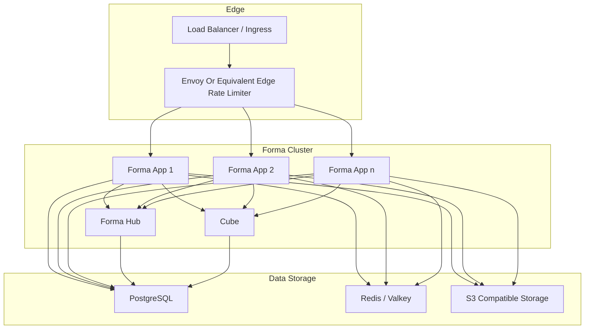

## Overview

Running Forma as a cluster of multiple instances gives you:

- **High Availability**: surveys remain accessible even if one app pod becomes unavailable
- **Load Distribution**: traffic can be spread across multiple stateless Forma app instances
- **Scalability**: you can scale app replicas horizontally as usage grows
- **Zero-Downtime Updates**: rolling deployments are possible with the right orchestration setup

## Requirements

For a Forma v5 cluster setup, plan for:

- shared PostgreSQL for Forma and Hub, with `pgvector` support if Hub shares the same database
- shared Redis/Valkey for caching, rate limiting, and audit-related flows
- shared S3-compatible storage if you use file uploads or organization branding assets
- a load balancer or ingress layer in front of the app
- Forma Hub as part of the runtime
- Cube, either bundled or externally managed
- Envoy Gateway or an equivalent external edge rate limiter for the v5-covered public and API-key routes

## Architecture



### Component Description

1. **Forma App Replicas**

   - stateless application instances that serve the UI, APIs, and survey flows
   - can be scaled horizontally behind a load balancer

2. **Forma Hub**

   - required in Forma v5
   - stores and serves Hub-backed feedback record data
   - can share the same PostgreSQL database as the main app when configured that way

3. **Cube**

   - required for the supported v5 analytics baseline
   - can run as the bundled service or as an external deployment shared by every app replica

4. **PostgreSQL**

   - primary persistent store for the Forma app and, by default, Hub
   - should be backed up and monitored like any other stateful production dependency

5. **Redis / Valkey**

   - required for caching, remaining application-enforced rate limits, and audit-related flows
   - should be shared across all app replicas

6. **S3-Compatible Storage**

   - used for file uploads and media-related features
   - should be shared across all replicas

7. **Edge Layer**

   - terminates or routes incoming traffic
   - enforces rate limiting for the route groups that moved out of the application server in v5

## Redis Configuration

<Note>
  Redis/Valkey is required for Forma to function. The application will not start without `REDIS_URL`.
</Note>

```sh env
REDIS_URL=redis://your-redis-host:6379
```

## S3 Configuration

```sh env
S3_ACCESS_KEY=your-access-key
S3_SECRET_KEY=your-secret-key
S3_REGION=your-region
S3_BUCKET_NAME=your-bucket-name

# For S3-compatible storage (e.g., StorJ, RustFS)
# Leave empty for Amazon S3
S3_ENDPOINT_URL=https://your-s3-compatible-endpoint

# Enable for RustFS and most third-party S3-compatible storage
# Set to 0 (or omit) for Amazon S3
S3_FORCE_PATH_STYLE=1
```

When using S3 in a cluster setup, ensure:

- all replicas use the same bucket
- CORS allows your Forma origin (for RustFS, set `RUSTFS_CORS_ALLOWED_ORIGINS`; see [File Uploads](/self-hosting/configuration/file-uploads#rustfs-cors-configuration))
- the credentials have read/write access for the assets you expect Forma to manage

## v5 Cluster Notes

### Hub Is Mandatory

Forma v5 self-hosting requires Hub. Do not plan a cluster upgrade that keeps Hub disabled.

### Edge Rate Limiting Must Exist Somewhere

You do not have to use the Forma Helm chart's Envoy bundle, but you do need equivalent edge protection for
the v5-covered public and API-key routes. Use the
[rate-limiting guide](/self-hosting/advanced/rate-limiting) for the exact route coverage.

### Cube Is Part Of The Baseline

Cube is part of the supported Forma v5 stack and powers analytics flows that depend on Cube queries. The
Docker Compose and Helm deployment paths bundle it by default. You can replace the bundled service with an
external Cube deployment, but do not remove Cube connectivity from the baseline configuration:

- keep the bundled Cube service enabled; or

## Kubernetes Setup

The current Kubernetes deployment path uses the OCI chart published from
[`charts/forma`](https://github.com/yldm-tech/forma/tree/main/charts/forma):

```sh
helm install forma oci://ghcr.io/yldm-tech/helm-charts/forma \
  -n forma \
  --create-namespace \
  -f values.yaml
```

For the Kubernetes-specific installation flow, mandatory Hub behavior, and Envoy bundle modes, use the dedicated
[Kubernetes deployment guide](/self-hosting/setup/kubernetes).
